<!-- README.md is generated from README.Rmd. Please edit that file -->

# Package *seedreg* 

**Authors**: Gabriel Danilo Shimizu; Hugo Roldi Guariz

Package: seedreg

Type: Package

Title: Regression for seeds

Version: 1.0.0

Author: Gabriel Danilo Shimizu

**Maintainer**: The package maintainer <shimizu@uel.br>

**Description**: The package is dedicated to regression analysis of
common models in scientific works and others with potential for use in
estimating the optimal, maximum and minimum temperature for the
occurrence of seed germination

License: What license is it under?

import: drc, ggplot2, car, crayon, emmeans, multcomp

Encoding: UTF-8

LazyData: true

RoxygenNote: 7.1.1

The influence of temperature on plant seed germination is a very popular
topic in agronomy. However, researchers have difficulty in estimating
the optimal, maximum and minimum points for the occurrence of
germination, often using inappropriate models. Thus, the present work
has the purpose of presenting regression models common in scientific
works and others with potential for use, implemented in the form of an R
package called seedreg. Eight regression models were implemented:
linear, quadratic, cubic, logistic of three or four parameters,
Brain-Cousens logistic with four and five parameters,
Cedergreen-Ritz-Streibig with four and five parameters, normal and
loess. The package returns the estimate of the optimal, maximum and
minimum points, in addition to statistical parameters, such as the
criteria of AIC, BIC, *R*<sup>2</sup>, significance of the coefficients.
Models can be accessed by the `LL_model()`,
`BC_model()`,`CD_model`,`normal_model`, `quali_model`, `loess_model` and
`LL_model()` functions.

## Installation

The package can be installed by the following command:

`devtools::install_github("https://github.com/AgronomiaR/seedreg", force=T)`

*Note*: Current versions of R require the installation of Rtools
software (<https://cran.r-project.org/bin/windows/Rtools/>) to download
packages that partially use the C++ language. The devtools package is
one of those packages that depend on this software.

## Usage

``` r
rm(list=ls())
library(seedreg)
data("aristolochia")
attach(aristolochia)
```

### Linear regression

``` r
a=LM_model(trat,resp)
#> Scale for 'colour' is already present. Adding another scale for 'colour',
#> which will replace the existing scale.
#> Warning in max(temp1[round(result) == "0" & temp1 > maximo]): nenhum argumento
#> não faltante para max; retornando -Inf
#> Warning in max(temp1[round(result) == "0"]): nenhum argumento não faltante para
#> max; retornando -Inf
#> 
#> ===================================
#> Predicted values and statistical parameters
#> ====================================
#> Note: if the maximum predicted value is equal to the maximum x, the curve does not have a maximum point within the studied range. If the minimum value is less than the lowest point studied, disregard the value.
#> Note: Lower AIC and BIC values and higher R-squared values indicate better models. VIF above 10 indicates variance inflation problem (Multicollinearity)
#> 
#> 
#> ====================================
#>             Estimate Std. Error   t value     Pr(>|t|)
#> (Intercept)   -52.50  8.0436071 -6.526922 6.166973e-09
#> trat            3.54  0.3095986 11.434161 2.398736e-18
#> $teste
#>                 Parameter      values
#> 1     optimum temperature  35.0000000
#> 2 Predicted maximum value        -Inf
#> 3 Predicted minimum value        -Inf
#> 4                     AIC 706.9321172
#> 5                     BIC 714.0781971
#> 6               r-squared   0.7443336
#> 
#> $VIF
#> [1] NA
#> 
#> [[3]]
```

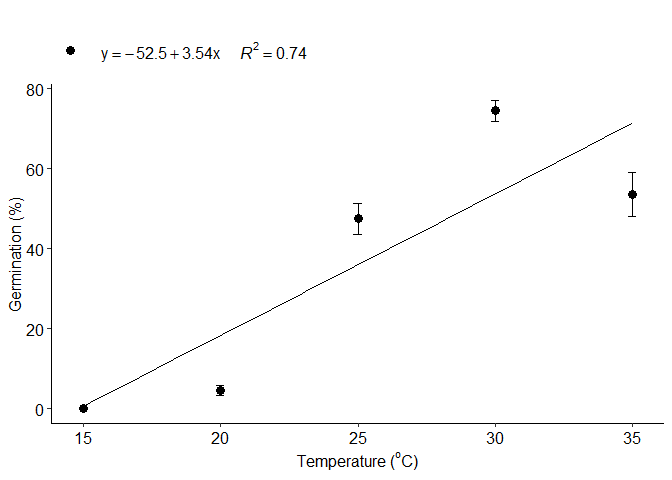

``` r
b=LM_model(trat,resp,grau = 2)
#> Scale for 'colour' is already present. Adding another scale for 'colour',
#> which will replace the existing scale.
#> Warning in max(temp1[round(result) == "0" & temp1 > maximo]): nenhum argumento
#> não faltante para max; retornando -Inf
#> 
#> ===================================
#> Predicted values and statistical parameters
#> ====================================
#> Note: if the maximum predicted value is equal to the maximum x, the curve does not have a maximum point within the studied range. If the minimum value is less than the lowest point studied, disregard the value.
#> Note: Lower AIC and BIC values and higher R-squared values indicate better models. VIF above 10 indicates variance inflation problem (Multicollinearity)
#> 
#> 
#> ====================================
#>                 Estimate  Std. Error   t value     Pr(>|t|)
#> (Intercept) -162.5714286 28.53350582 -5.697562 2.124445e-07
#> trat          13.1114286  2.41373278  5.432013 6.288396e-07
#> I(trat^2)     -0.1914286  0.04794024 -3.993067 1.478864e-04
#> $teste
#>                 Parameter      values
#> 1     optimum temperature  34.2459246
#> 2 Predicted maximum value        -Inf
#> 3 Predicted minimum value  16.3301330
#> 4                     AIC 693.8762781
#> 5                     BIC 703.4043847
#> 6               r-squared   0.8205139
#> 
#> $VIF
#>      trat I(trat^2) 
#>  72.42857  72.42857 
#> 
#> [[3]]
```

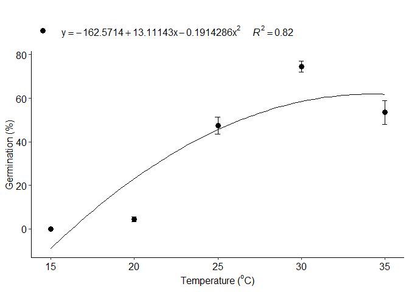

``` r
c=LM_model(trat,resp, grau=3)
#> Scale for 'colour' is already present. Adding another scale for 'colour',
#> which will replace the existing scale.
#> Warning in max(temp1[round(result) == "0" & temp1 > maximo]): nenhum argumento
#> não faltante para max; retornando -Inf
#> 
#> ===================================
#> Predicted values and statistical parameters
#> ====================================
#> Note: if the maximum predicted value is equal to the maximum x, the curve does not have a maximum point within the studied range. If the minimum value is less than the lowest point studied, disregard the value.
#> Note: Lower AIC and BIC values and higher R-squared values indicate better models. VIF above 10 indicates variance inflation problem (Multicollinearity)
#> 
#> 
#> ====================================
#>                 Estimate   Std. Error   t value     Pr(>|t|)
#> (Intercept) 615.92857143 94.631279296  6.508721 7.284199e-09
#> trat        -90.11190476 12.369050966 -7.285272 2.537032e-10
#> I(trat^2)     4.13357143  0.514234979  8.038293 9.299156e-12
#> I(trat^3)    -0.05766667  0.006840848 -8.429754 1.653134e-12
#> $teste
#>                 Parameter      values
#> 1     optimum temperature  30.9655966
#> 2 Predicted maximum value        -Inf
#> 3 Predicted minimum value  19.0024002
#> 4                     AIC 643.0672814
#> 5                     BIC 654.9774146
#> 6               r-squared   0.9982817
#> 
#> $VIF
#>      trat I(trat^2) I(trat^3) 
#>  3632.540 15916.179  4488.194 
#> 
#> [[3]]
```

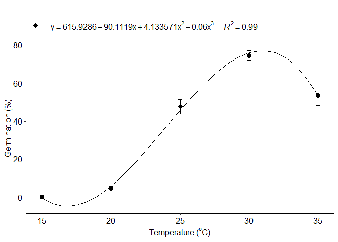

### Logistic regression

``` r
d=LL_model(trat,resp,npar = "LL.3")
#> Warning in max(temp1[round(result) == "0" & temp1 > maximo]): nenhum argumento
#> não faltante para max; retornando -Inf
#> 
#> Model fitted: Log-logistic (ED50 as parameter) with lower limit at 0 (3 parms)
#> 
#> Parameter estimates:
#> 
#>                Estimate Std. Error t-value   p-value    
#> b:(Intercept) -19.40819    7.22347 -2.6868  0.008834 ** 
#> d:(Intercept)  63.94663    2.65919 24.0474 < 2.2e-16 ***
#> e:(Intercept)  23.57567    0.70284 33.5436 < 2.2e-16 ***
#> ---
#> Signif. codes:  0 '***' 0.001 '**' 0.01 '*' 0.05 '.' 0.1 ' ' 1
#> 
#> Residual standard error:
#> 
#>  14.63286 (77 degrees of freedom)
#> 
#> Model fitted: Log-logistic (ED50 as parameter) with lower limit at 0 (3 parms)
#> 
#> Parameter estimates:
#> 
#>                Estimate Std. Error t-value   p-value    
#> b:(Intercept) -19.40819    7.22347 -2.6868  0.008834 ** 
#> d:(Intercept)  63.94663    2.65919 24.0474 < 2.2e-16 ***
#> e:(Intercept)  23.57567    0.70284 33.5436 < 2.2e-16 ***
#> ---
#> Signif. codes:  0 '***' 0.001 '**' 0.01 '*' 0.05 '.' 0.1 ' ' 1
#> 
#> Residual standard error:
#> 
#>  14.63286 (77 degrees of freedom)
#> 
#> ===================================
#> Predicted values and statistical parameters
#> ====================================
#> Note: if the maximum predicted value is equal to the maximum x, the curve does not have a maximum point within the studied range. If the minimum value is less than the lowest point studied, disregard the value.
#> 
#> Note: Lower AIC and BIC values and higher R-squared values indicate better models. 
#> 
#> 
#> ====================================
#> $teste
#>                 Parameter      values
#> 1     optimum temperature  35.0000000
#> 2 Predicted maximum value        -Inf
#> 3 Predicted minimum value  18.3683368
#> 4                     AIC 661.2956178
#> 5                     BIC 670.8237244
#> 6               r-squared   0.7943074
#> 
#> [[2]]
```


``` r
e=LL_model(trat,resp,npar = "LL.4")
#> Warning in max(temp1[round(result) == "0" & temp1 < maximo]): nenhum argumento
#> não faltante para max; retornando -Inf
#> Warning in max(temp1[round(result) == "0" & temp1 > maximo]): nenhum argumento
#> não faltante para max; retornando -Inf
#> 
#> Model fitted: Log-logistic (ED50 as parameter) (4 parms)
#> 
#> Parameter estimates:
#> 
#>               Estimate Std. Error t-value p-value    
#> b:(Intercept) -48.2686   121.7112 -0.3966  0.6928    
#> c:(Intercept)   2.0836     2.5960  0.8026  0.4247    
#> d:(Intercept)  63.9961     2.5954 24.6572  <2e-16 ***
#> e:(Intercept)  24.4808     1.3094 18.6960  <2e-16 ***
#> ---
#> Signif. codes:  0 '***' 0.001 '**' 0.01 '*' 0.05 '.' 0.1 ' ' 1
#> 
#> Residual standard error:
#> 
#>  14.6807 (76 degrees of freedom)
#> 
#> Model fitted: Log-logistic (ED50 as parameter) (4 parms)
#> 
#> Parameter estimates:
#> 
#>               Estimate Std. Error t-value p-value    
#> b:(Intercept) -48.2686   121.7112 -0.3966  0.6928    
#> c:(Intercept)   2.0836     2.5960  0.8026  0.4247    
#> d:(Intercept)  63.9961     2.5954 24.6572  <2e-16 ***
#> e:(Intercept)  24.4808     1.3094 18.6960  <2e-16 ***
#> ---
#> Signif. codes:  0 '***' 0.001 '**' 0.01 '*' 0.05 '.' 0.1 ' ' 1
#> 
#> Residual standard error:
#> 
#>  14.6807 (76 degrees of freedom)
#> 
#> ===================================
#> Predicted values and statistical parameters
#> ====================================
#> Note: if the maximum predicted value is equal to the maximum x, the curve does not have a maximum point within the studied range. If the minimum value is less than the lowest point studied, disregard the value.
#> 
#> Note: Lower AIC and BIC values and higher R-squared values indicate better models. 
#> 
#> 
#> ====================================
#> $teste
#>                 Parameter      values
#> 1     optimum temperature  35.0000000
#> 2 Predicted maximum value        -Inf
#> 3 Predicted minimum value        -Inf
#> 4                     AIC 662.7721102
#> 5                     BIC 674.6822433
#> 6               r-squared   0.7953455
#> 
#> [[2]]
```

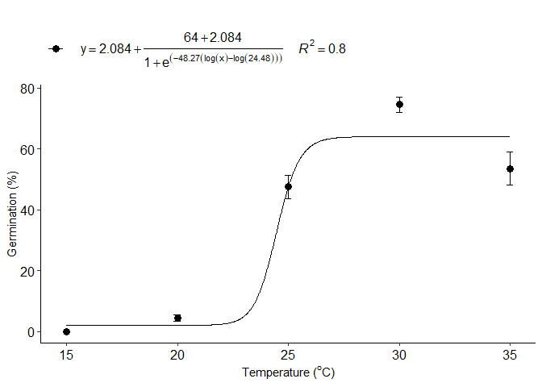

### Logistic regression Brain-Cousens

``` r
f=BC_model(trat,resp, npar = "BC.4")
#> Warning in max(temp1[round(result) == "0" & temp1 > maximo]): nenhum argumento
#> não faltante para max; retornando -Inf
#> 
#> Model fitted: Brain-Cousens (hormesis) with lower limit fixed at 0 (4 parms)
#> 
#> Parameter estimates:
#> 
#>                Estimate Std. Error t-value   p-value    
#> b:(Intercept) -13.95721    3.65564 -3.8180 0.0002727 ***
#> d:(Intercept) 250.77475   60.32596  4.1570 8.381e-05 ***
#> e:(Intercept)  25.50595    0.69513 36.6923 < 2.2e-16 ***
#> f:(Intercept)  -5.61797    1.74018 -3.2284 0.0018389 ** 
#> ---
#> Signif. codes:  0 '***' 0.001 '**' 0.01 '*' 0.05 '.' 0.1 ' ' 1
#> 
#> Residual standard error:
#> 
#>  12.92089 (76 degrees of freedom)
#> 
#> ===================================
#> Predicted values and statistical parameters
#> ====================================
#> Note: if the maximum predicted value is equal to the maximum x, the curve does not have a maximum point within the studied range. If the minimum value is less than the lowest point studied, disregard the value.
#> 
#> Note: Lower AIC and BIC values and higher R-squared values indicate better models. 
#> 
#> 
#> ====================================
#> $teste
#>                 Parameter      values
#> 1     optimum temperature  29.1414141
#> 2 Predicted maximum value        -Inf
#> 3 Predicted minimum value  16.9061906
#> 4                     AIC 642.3420163
#> 5                     BIC 654.2521495
#> 6               r-squared   0.8414623
#> 
#> [[2]]
```

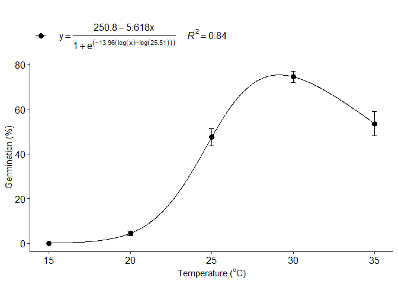

``` r
g=BC_model(trat,resp, npar = "BC.5")
#> Warning in max(temp1[round(result) == "0" & temp1 > maximo]): nenhum argumento
#> não faltante para max; retornando -Inf
#> 
#> Model fitted: Generalized log-logistic (ED50 as parameter) (5 parms)
#> 
#> Parameter estimates:
#> 
#>                Estimate Std. Error t-value p-value    
#> b:(Intercept) -59.27493  215.42337 -0.2752  0.7840    
#> c:(Intercept)  -0.18797    4.13493 -0.0455  0.9639    
#> d:(Intercept)  64.00006    2.59966 24.6186  <2e-16 ***
#> e:(Intercept)  25.62206    1.21891 21.0205  <2e-16 ***
#> f:(Intercept)   0.17829    0.68758  0.2593  0.7961    
#> ---
#> Signif. codes:  0 '***' 0.001 '**' 0.01 '*' 0.05 '.' 0.1 ' ' 1
#> 
#> Residual standard error:
#> 
#>  14.70436 (75 degrees of freedom)
#> 
#> ===================================
#> Predicted values and statistical parameters
#> ====================================
#> Note: if the maximum predicted value is equal to the maximum x, the curve does not have a maximum point within the studied range. If the minimum value is less than the lowest point studied, disregard the value.
#> 
#> Note: Lower AIC and BIC values and higher R-squared values indicate better models. 
#> 
#> 
#> ====================================
#> $teste
#>                 Parameter      values
#> 1     optimum temperature  35.0000000
#> 2 Predicted maximum value        -Inf
#> 3 Predicted minimum value  16.6801680
#> 4                     AIC 663.9700837
#> 5                     BIC 678.2622435
#> 6               r-squared   0.7973767
#> 
#> [[2]]
```

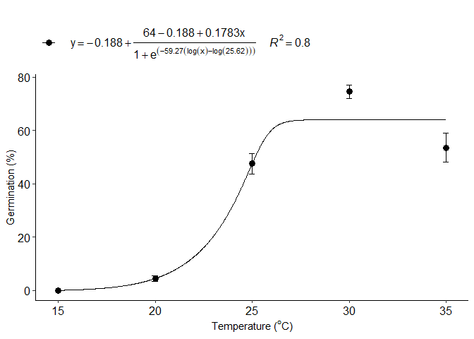

### Logistic regression Cedergreen-Ritz-Streibig

``` r
h=CD_model(trat,resp, npar = "CRS.4")
#> Warning in max(temp1[round(result) == "0" & temp1 > maximo]): nenhum argumento
#> não faltante para max; retornando -Inf
#> 
#> Model fitted: Cedergreen-Ritz-Streibig with lower limit 0 (alpha=1) (4 parms)
#> 
#> Parameter estimates:
#> 
#>                  Estimate  Std. Error t-value   p-value    
#> b:(Intercept)   -14.42145     3.53110 -4.0841 0.0001085 ***
#> d:(Intercept)  6110.38907  1944.20876  3.1429 0.0023858 ** 
#> e:(Intercept)    25.81624     0.75778 34.0682 < 2.2e-16 ***
#> f:(Intercept) -6231.70537  2001.17232 -3.1140 0.0026022 ** 
#> ---
#> Signif. codes:  0 '***' 0.001 '**' 0.01 '*' 0.05 '.' 0.1 ' ' 1
#> 
#> Residual standard error:
#> 
#>  12.92096 (76 degrees of freedom)
#> 
#> ===================================
#> Predicted values and statistical parameters
#> ====================================
#> Note: if the maximum predicted value is equal to the maximum x, the curve does not have a maximum point within the studied range. If the minimum value is less than the lowest point studied, disregard the value.
#> 
#> Note: Lower AIC and BIC values and higher R-squared values indicate better models. 
#> 
#> 
#> ====================================
#> $teste
#>                 Parameter      values
#> 1     optimum temperature  28.9633963
#> 2 Predicted maximum value        -Inf
#> 3 Predicted minimum value  16.8361836
#> 4                     AIC 642.3427825
#> 5                     BIC 654.2529157
#> 6               r-squared   0.8414613
#> 
#> [[2]]
```


``` r
i=CD_model(trat,resp, npar = "CRS.5")
#> Warning in max(temp1[round(result) == "0" & temp1 > maximo]): nenhum argumento
#> não faltante para max; retornando -Inf
#> 
#> Model fitted: Generalized log-logistic (ED50 as parameter) (5 parms)
#> 
#> Parameter estimates:
#> 
#>                Estimate Std. Error t-value p-value    
#> b:(Intercept) -59.27493  215.42337 -0.2752  0.7840    
#> c:(Intercept)  -0.18797    4.13493 -0.0455  0.9639    
#> d:(Intercept)  64.00006    2.59966 24.6186  <2e-16 ***
#> e:(Intercept)  25.62206    1.21891 21.0205  <2e-16 ***
#> f:(Intercept)   0.17829    0.68758  0.2593  0.7961    
#> ---
#> Signif. codes:  0 '***' 0.001 '**' 0.01 '*' 0.05 '.' 0.1 ' ' 1
#> 
#> Residual standard error:
#> 
#>  14.70436 (75 degrees of freedom)
#> 
#> ===================================
#> Predicted values and statistical parameters
#> ====================================
#> Note: if the maximum predicted value is equal to the maximum x, the curve does not have a maximum point within the studied range. If the minimum value is less than the lowest point studied, disregard the value.
#> 
#> Note: Lower AIC and BIC values and higher R-squared values indicate better models. 
#> 
#> 
#> ====================================
#> $teste
#>                 Parameter      values
#> 1     optimum temperature  35.0000000
#> 2 Predicted maximum value        -Inf
#> 3 Predicted minimum value  16.6801680
#> 4                     AIC 663.9700837
#> 5                     BIC 678.2622435
#> 6               r-squared   0.7973767
#> 
#> [[2]]
```

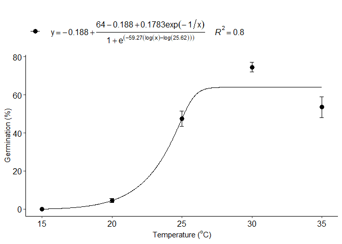

### Normal model

``` r
j=normal_model(trat,resp)
#> Warning in max(temp1[round(result) == "0" & temp1 < maximo]): nenhum argumento
#> não faltante para max; retornando -Inf
#> Warning in max(temp1[round(result) == "0" & temp1 > maximo]): nenhum argumento
#> não faltante para max; retornando -Inf
#> 
#> Formula: resp ~ a * exp(-1/2 * (trat - b)^2/c^2)
#> 
#> Parameters:
#>   Estimate Std. Error t value Pr(>|t|)    
#> a  76.9526     3.1188   24.67   <2e-16 ***
#> b  30.4797     0.2581  118.09   <2e-16 ***
#> c   5.1641     0.2934   17.60   <2e-16 ***
#> ---
#> Signif. codes:  0 '***' 0.001 '**' 0.01 '*' 0.05 '.' 0.1 ' ' 1
#> 
#> Residual standard error: 13.22 on 77 degrees of freedom
#> 
#> Number of iterations to convergence: 10 
#> Achieved convergence tolerance: 7.538e-06
#> 
#> 
#> ===================================
#> Predicted values and statistical parameters
#> ====================================
#> Note: if the maximum predicted value is equal to the maximum x, the curve does not have a maximum point within the studied range. If the minimum value is less than the lowest point studied, disregard the value.
#> 
#> Note: Lower AIC and BIC values and higher R-squared values indicate better models. 
#> 
#> 
#> ====================================
#> $teste
#>                 Parameter      values
#> 1     optimum temperature  30.4795480
#> 2 Predicted maximum value        -Inf
#> 3 Predicted minimum value        -Inf
#> 4                     AIC 645.0511211
#> 5                     BIC 654.5792276
#> 6               r-squared   0.8332529
#> 
#> [[2]]
```

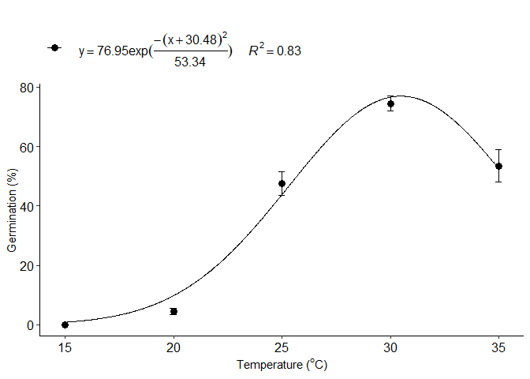

### Loess model

``` r
k=loess_model(trat,resp)
#> Warning in max(temp1[round(result) == "0" & temp1 > maximo]): nenhum argumento
#> não faltante para max; retornando -Inf
#> 
#> ===================================
#> Predicted maximum and minimum values
#> ====================================
#> Note: if the maximum predicted value is equal to the maximum x, the curve does not have a maximum point within the studied range. If the minimum value is less than the lowest point studied, disregard the value.
#> 
#> $teste
#>                 Parameter   values
#> 1     optimum temperature 30.31153
#> 2 Predicted maximum value     -Inf
#> 3 Predicted minimum value 18.99240
#> 
#> [[2]]
```


### Piecewise linear-linear regression

``` r
l=piecewisel_model(trat,resp)
#> Warning in data.frame(x = temp2, y = predict(model, x = temp2)): row names were
#> found from a short variable and have been discarded
#> Warning in max(temp2[round(preditos1$y) == "0"]): nenhum argumento não faltante
#> para max; retornando -Inf
#> Warning in max(temp2[round(preditos1$y) == "0" && preditos1$y > breaks]): nenhum
#> argumento não faltante para max; retornando -Inf
#> 
#> Call:
#> stats::lm(formula = y ~ x + w)
#> 
#> Residuals:
#>     Min      1Q  Median      3Q     Max 
#> -28.950 -11.600   2.775   8.350  46.500 
#> 
#> Coefficients:
#>             Estimate Std. Error t value Pr(>|t|)    
#> (Intercept) -88.3000     7.7231 -11.433  < 2e-16 ***
#> x             5.3300     0.3331  16.000  < 2e-16 ***
#> w            -9.4783     1.2473  -7.599 5.99e-11 ***
#> ---
#> Signif. codes:  0 '***' 0.001 '**' 0.01 '*' 0.05 '.' 0.1 ' ' 1
#> 
#> Residual standard error: 14.9 on 77 degrees of freedom
#> Multiple R-squared:  0.7865, Adjusted R-squared:  0.7809 
#> F-statistic: 141.8 on 2 and 77 DF,  p-value: < 2.2e-16
#> 
#> 
#> ===================================
#> Predicted values and statistical parameters
#> ====================================
#> Note: if the maximum predicted value is equal to the maximum x, the curve does not have a maximum point within the studied range. If the minimum value is less than the lowest point studied, disregard the value.
#> 
#> Note: Lower AIC and BIC values and higher R-squared values indicate better models. 
#> 
#> 
#> ====================================
#> $teste
#>                 Parameter   values
#> 1     optimum temperature  30.2787
#> 2 Predicted maximum value     -Inf
#> 3 Predicted minimum value     -Inf
#> 4                     AIC 664.1642
#> 5                     BIC 673.6923
#> 6               r-squared   0.7900
#> 
#> [[2]]
```

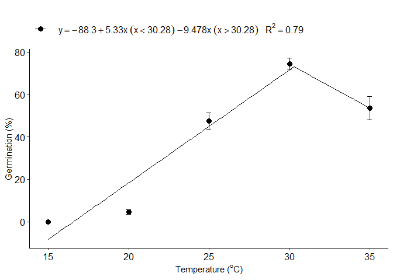

### Merge multiple curves into a single graph

``` r
seedreg::multicurve(list(a,b,c,d,e,f,g,h,i,j,k,l),legend.position = "right")
```

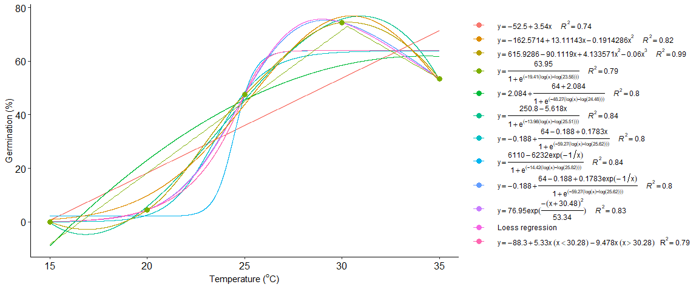

### Add name in multicurve legend

``` r
seedreg::multicurve(list(a,b,c,d,e,f,g,h,i,j,k,l),
                    trat=c("(italic(Linear))",
                           "(italic(Quadratic))",
                           "(italic(Cubic))",
                           "(italic(LL.3))",
                           "(italic(LL.4))",
                           "(italic(BC.4))",
                           "(italic(BC.5))",
                           "(italic(CD.4))",
                           "(italic(CD.5))",
                           "(italic(Normal))",
                           "(italic(loess))",
                           "(italic(Piecewise))"),
                    legend.position = "right")
```

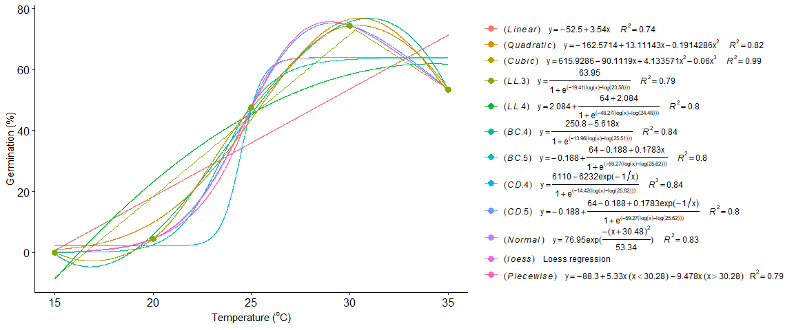

### Qualitative analysis

``` r
quali_model(trat, resp,family = "quasibinomial")
#> Quasi-binomial model
#> Note: adjust = "tukey" was changed to "sidak"
#> because "tukey" is only appropriate for one set of pairwise comparisons
```

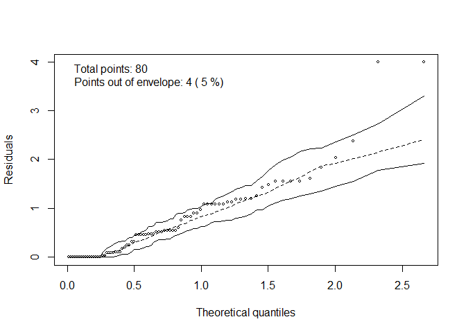

    #> 
    #> =======================================================
    #> Analysis of Deviance Table (Type II tests)
    #> 
    #> Response: cbind(nseeds, n - nseeds)
    #>      LR Chisq Df Pr(>Chisq)    
    #> trat    460.7  4  < 2.2e-16 ***
    #> ---
    #> Signif. codes:  0 '***' 0.001 '**' 0.01 '*' 0.05 '.' 0.1 ' ' 1
    #> 
    #> =======================================================
    #>  trat  prob       SE  df asymp.LCL asymp.UCL .group
    #>  15   0.000 1.41e-06 Inf -3.60e-06  3.60e-06     d 
    #>  20   0.045 1.45e-02 Inf  7.65e-03  8.24e-02    c  
    #>  25   0.475 3.50e-02 Inf  3.85e-01  5.65e-01   b   
    #>  30   0.745 3.06e-02 Inf  6.66e-01  8.24e-01  a    
    #>  35   0.535 3.50e-02 Inf  4.45e-01  6.25e-01   b   
    #> 
    #> Confidence level used: 0.95 
    #> Conf-level adjustment: sidak method for 5 estimates 
    #> P value adjustment: tukey method for comparing a family of 5 estimates 
    #> significance level used: alpha = 0.05 
    #> 
    #> =======================================================

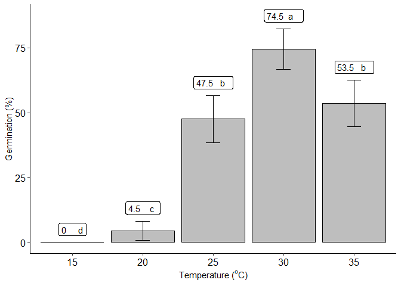
